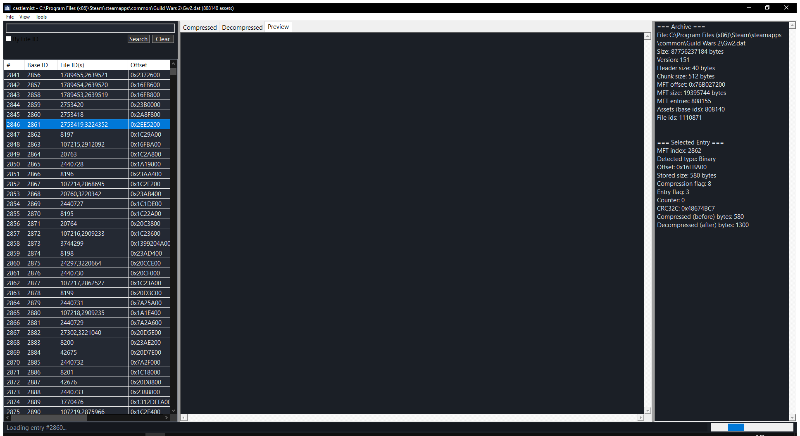
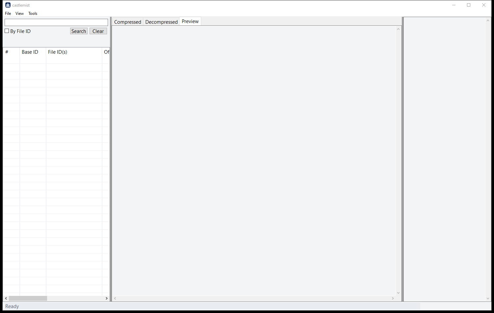
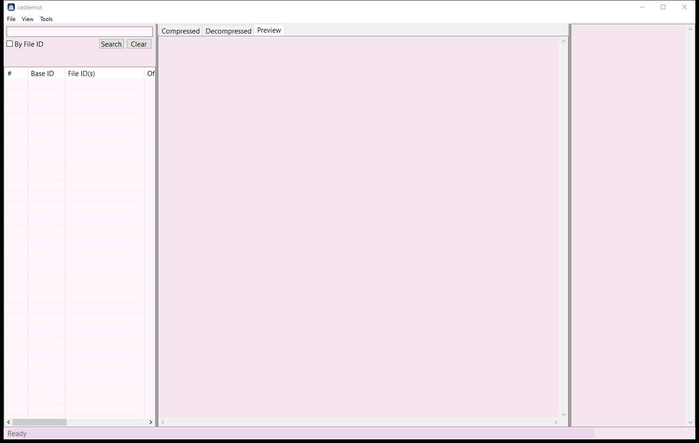

# castlemist

An explorer for the Guild Wars 2 `.dat` archive: browse the MFT, decode the
formats inside it, and preview textures, models, maps, audio and video without
launching the game.

Win32 + Direct3D 11, C++20, built with MinGW-w64.



## Themes

Dark by default, light, or a custom accent -- **View > Theme**. The custom mode
picks its base palette from the accent's luminance, so a bright accent lands on
a light base and a dark one on a dark base rather than leaving you to work out
which is readable.

| light | custom accent |
| --- | --- |
|  |  |

> Two controls -- the search box and the tab strip -- still render light in dark
> mode. They are common controls that ignore the brush from `WM_CTLCOLOR*` and
> are not covered by Windows' `DarkMode_*` themes; fixing them properly means
> owner-drawing both.

## Running it

```bash
castlemist.exe
```

Or open an archive, and optionally an entry, straight away:

```bash
castlemist.exe "C:/Program Files (x86)/Steam/steamapps/common/Guild Wars 2/Gw2.dat" 2871
```

The second argument is a **baseId** -- the ids in
[`docs/research/curated-test-ids.txt`](docs/research/curated-test-ids.txt) are
baseIds, and mixing them up with fileIds is the usual reason a known-good id
resolves to something unexpected.

## Layout

| directory   | what lives there                                                    |
| ----------- | ------------------------------------------------------------------- |
| `src/`      | the application, one directory per layer -- see below                |
| `include/`  | public headers, always included as `castlemist/<layer>/<file>.h`      |
| `tests/`    | unit tests, one file per layer, run with `ctest`                     |
| `tools/`    | standalone dump / convert / probe utilities (indexer, dat CLI, shader and strs extractors, in-process hooks) |
| `mcp/`      | Model Context Protocol servers exposing the dat, the index and RenderDoc captures to an agent |
| `docs/`     | architecture, build and testing guides plus the reverse-engineering notes |
| `dumps/`    | where the tools write their output -- untracked, generate your own    |
| `external/` | third-party libraries -- untracked, see `external/README.md`          |

## The stack

Dependencies point downward only. Nothing below `ui` may include a ui header,
and nothing below `render` may touch Direct3D.

```
app       WinMain, the process entry point                    (castlemist.exe)
 +-- ui       Win32 shell: window procs, widgets, layout, content browser
      +-- render   Direct3D 11 image / model / scene renderers
      |    +-- sim      the reverse-engineered GW2 cloth solver
      +-- extract  MFT entry -> previewable payload (the format dispatcher)
      |    +-- media    audio (dr_mp3 / stb_vorbis) and Bink video playback
      |    +-- format   single-format decoders (dds, strs, chat links, ...)
      +-- db       SQLite reader for the index that tools/gw2index builds
           +-- core     byte readers and other dependency-free helpers
                +-- native  GW2 dat/MFT, method-0 codec, ATEX, MODL, granny
```

Each layer builds as its own DLL in the development presets, so editing one
file relinks one DLL rather than the whole program. The release presets archive
everything into a single self-contained executable.

## Building

Needs MinGW-w64 (GCC 13+), CMake 3.21+, Ninja, and the libraries listed in
[`external/README.md`](external/README.md).

```bash
cmake --preset debug
```

```bash
cmake --build --preset debug
```

```bash
ctest --preset debug
```

Presets: `debug`, `relwithdebinfo` (both DLL layers), `release`, `minsizerel`
(both a single static exe), and `ci`. Full details, including the MinGW runtime
pitfall that shows up as `0xC0000139` at startup, are in
[`docs/building.md`](docs/building.md).

## Where the knowledge is

castlemist is the readable form of a long reverse-engineering effort: the
formats it parses were recovered from the client binary, not from documentation.
[`docs/research/`](docs/research) holds those notes -- the dat's Huffman codec,
the ATEX container, MODL geometry and skinning, the map heightmap tiling, the
particle and cloth solvers, the string-table RC4, the shader cache layout. Each
one explains what the code does and, more usefully, why it looks the way it does.

## Licence

MIT -- see [LICENSE](LICENSE).

Not affiliated with or endorsed by ArenaNet or NCSOFT. Guild Wars 2 and its
assets are their property; castlemist ships none of them and reads only files
you already have.
